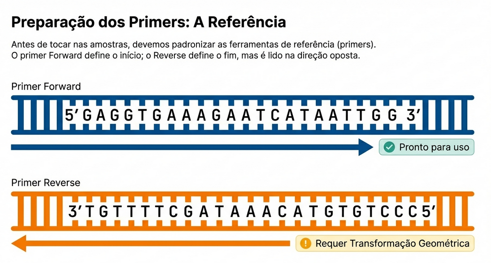
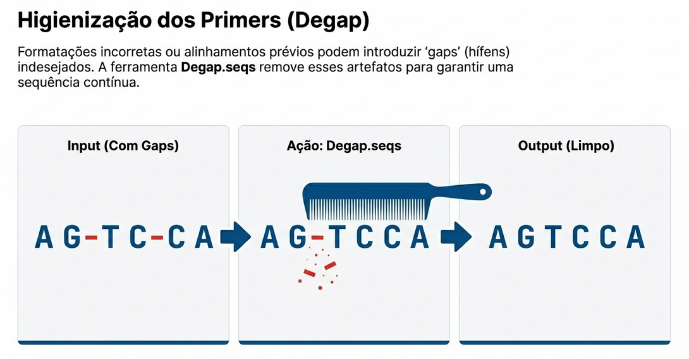
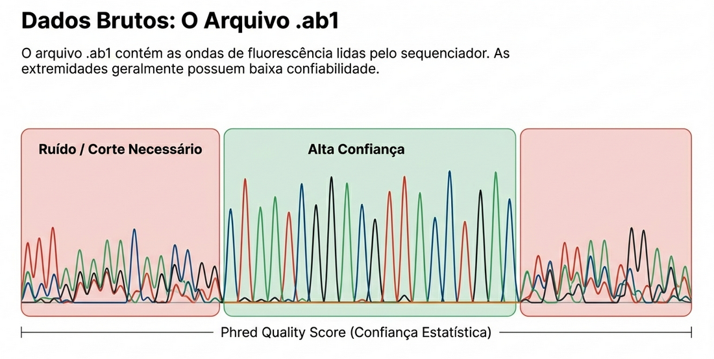
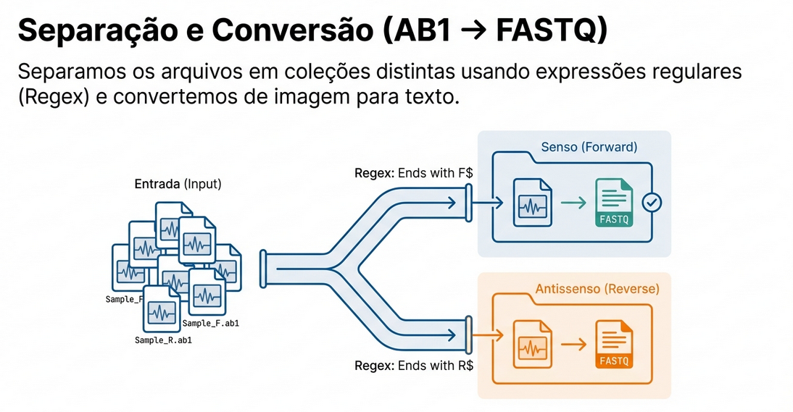
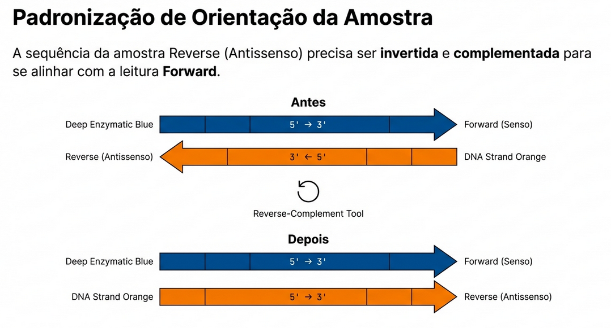
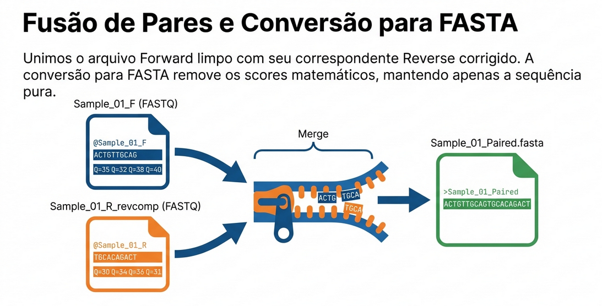
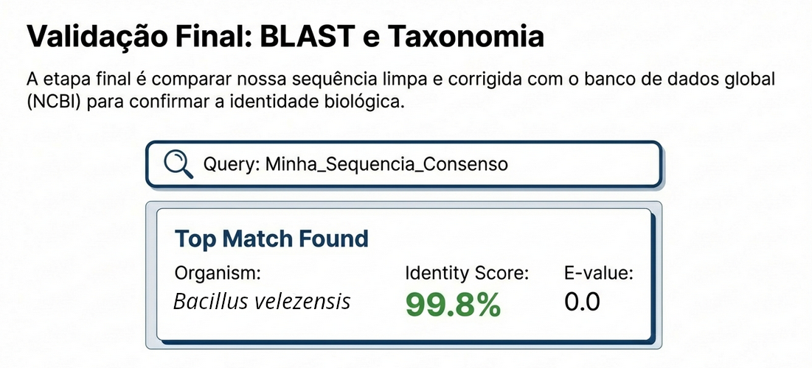

------------------------------------------------------------------------

# Introdução {#sec-intro}

O sequenciamento de Sanger é uma das técnicas mais utilizadas para
verificar e caracterizar sequências de DNA de interesse. No contexto de
microbiologia molecular, o gene **recA** é um marcador amplamente
utilizado para:

-   Identificação taxonômica de bactérias
-   Estudos filogenéticos em *Escherichia coli*, *Bacillus subtilis*,
    *Pseudomonas aeruginosa* e outros organismos
-   Análises de diversidade genética bacteriana

Neste tutorial, você aprenderá a processar arquivos de sequenciamento
Sanger (formato `.ab1`) de forma reprodutível na plataforma **Galaxy**,
passando por todas as etapas:

1.  Preparação dos primers
2.  Limpeza e corte por qualidade das sequências
3.  Obtenção da sequência consenso
4.  Alinhamento final e verificação taxonômica por BLAST

::: callout-note
## Contexto biológico --- Gene *recA*

O gene *recA* codifica a proteína RecA, essencial para o reparo de DNA e
a recombinação homóloga em bactérias. Seu tamanho (\~1 kb) e a
conservação entre espécies o tornam um excelente marcador filogenético.
Em estudos de identificação bacteriana, amplicons do *recA* são gerados
com primers universais ou espécie-específicos e, em seguida,
sequenciados pelo método de Sanger.
:::

------------------------------------------------------------------------

# O Sequenciamento de Sanger e o formato AB1 {#sec-sanger}

## Como funciona o Sanger

No sequenciamento de Sanger (também chamado de sequenciamento por
terminação de cadeia), um **primer** se liga ao molde de DNA, e a reação
de extensão produz fragmentos de comprimentos variados que terminam em
didesoxinucleotídeos (ddNTPs) fluorescentes. Um eletroforese capilar
separa esses fragmentos por tamanho, e um detector lê a fluorescência,
gerando o **cromatograma**.

```         
Molde:  5'---ATGCGTAACTTGAC---3'
Primer:         →→→→→→→
Reads:  → fragmentos com ddNTPs nos terminais
Leitura: ATGCGTAACTTGAC... (cromatograma)
```


## O arquivo AB1

O arquivo `.ab1` é o formato binário padrão (Applied Biosystems) que
armazena:

| Campo               | Conteúdo                                         |
|---------------------|--------------------------------------------------|
| Sequência de bases  | Chamada automática de nucleotídeos (basecalling) |
| Scores de qualidade | Confiança de cada base (escala Phred)            |
| Cromatograma        | Intensidade dos quatro canais de fluorescência   |
| Metadados           | Nome da amostra, primer, data, etc.              |

: Estrutura do arquivo AB1 {#tbl-ab1}

Para cada amostra, geralmente se obtêm **dois arquivos AB1**:

-   **Arquivo Forward (F)**: sequência da fita sentido, lida 5'→3' com o
    primer forward
-   **Arquivo Reverse (R)**: sequência da fita antissentido, lida 5'→3'
    com o primer reverse

::: callout-important
## Por que precisamos de dois arquivos por amostra?

O sequenciamento Sanger lê apenas uma fita por vez. Ao sequenciar com
primers forward **e** reverse, cobrimos as duas extremidades do amplicon
com mais confiança e conseguimos, após combinar as leituras, uma
sequência consenso mais confiável e completa.
:::

------------------------------------------------------------------------

# Visão Geral do Pipeline {#sec-pipeline}

```         
Arquivo ZIP com AB1s
        │
        ▼
   [Unzip] → Coleção de AB1s
        │
        ├──────────────────────────────┐
        ▼                              ▼
  AB1s Forward (F)             AB1s Reverse (R)
        │                              │
   [AB1 → FASTQ]               [AB1 → FASTQ]
        │                              │
   [Trimmomatic/                [Trimmomatic/
    Trim sequences]              Trim sequences]
        │                              │
        │                    [Reverse-Complement]
        │                              │
        └──────────┬───────────────────┘
                   ▼
          [Merge F + R por amostra]
                   │
          [FASTQ → FASTA]
                   │
          [Alinhamento (MAFFT)]
                   │
          [Consenso por amostra]
                   │
        ┌──────────┴────────────┐
        ▼                       ▼
  Primers (formatados)   Consensos das amostras
        └──────────┬────────────┘
                   ▼
       [Merge + Alinhamento Final]
                   │
               [BLAST]
                   │
           Identificação taxonômica
```


## Workflow no Galaxy


------------------------------------------------------------------------

# Preparação dos Dados {#sec-dados}

## Exemplo de conjunto de dados --- gene *recA*

Neste tutorial usamos como exemplo amostras bacterianas de três isolados
de *E. coli* (EC01, EC02, EC03) sequenciadas com primers universais do
gene *recA*:

```         
>Forward_recA
MGKDRQKDIFESLKRYGD
```

Sequências reais de primers *recA* bacteriano (exemplo):

```         
>Forward_recA
ATGCAGATCTTCGAAAAGAAAG
>Reverse_recA
TTAGTTCTTCTGGTCGTTCTTG
```

::: callout-note
## Primers do gene *recA*

Os primers acima são baseados em regiões conservadas do gene *recA* de
enterobactérias (\~1050 pb de amplicon). Para outros grupos bacterianos,
utilize primers específicos do grupo de interesse.
:::

## Estrutura dos arquivos de entrada

Os arquivos AB1 devem ser nomeados de forma clara para facilitar a
filtragem posterior. Uma convenção recomendada é:

```         
EC01_recA_F.ab1   ← Isolado EC01, gene recA, primer Forward
EC01_recA_R.ab1   ← Isolado EC01, gene recA, primer Reverse
EC02_recA_F.ab1
EC02_recA_R.ab1
EC03_recA_F.ab1
EC03_recA_R.ab1
```

O sufixo `_F` (Forward) e `_R` (Reverse) será usado nas expressões
regulares para separar as coleções.

------------------------------------------------------------------------

# Passo a Passo no Galaxy {#sec-galaxy}

## Passo 1 --- Upload dos dados

::: callout-tip
## O que fazer

1.  Acesse o Galaxy em [usegalaxy.eu](https://usegalaxy.eu)
    (recomendado) ou [usegalaxy.org](https://usegalaxy.org)
2.  Crie um novo histórico: clique em **"+"** no painel de Histórico e
    dê o nome `recA_Sanger_analysis`
3.  Faça upload do arquivo ZIP contendo todos os arquivos AB1
4.  Faça upload do arquivo FASTA com os primers
:::

### Arquivo de primers (criar manualmente)

Cole o conteúdo abaixo no Galaxy (Upload → Paste/Fetch Data), defina o
tipo como `fasta` e nomeie como `Primers_recA`:

``` fasta
>Forward_recA
ATGCAGATCTTCGAAAAGAAAG
>Reverse_recA
TTAGTTCTTCTGGTCGTTCTTG
```

------------------------------------------------------------------------

## Passo 2 --- Preparação dos Primers {#sec-primers}

Os primers forward e reverse precisam de tratamentos diferentes: o
primer **reverse** deve ter sua sequência reverse-complementada para
ficar na mesma orientação que as sequências forward.



### 2.1 --- Filtrar primer Forward

**Ferramenta:** `Filter FASTA` (versão 2.3)

| Parâmetro          | Valor                               |
|--------------------|-------------------------------------|
| FASTA sequences    | `Primers_recA`                      |
| Criteria           | `Regular expression on the headers` |
| Regular expression | `Forward_recA`                      |

: Parâmetros para filtrar primer forward {#tbl-filter-fwd}

**Por que?** Separamos os primers em arquivos individuais porque o
primer reverse precisará ser reverse-complementado antes do alinhamento
final.

**Adicionar tag:** `#Primer` e `#Forward`

------------------------------------------------------------------------

### 2.2 --- Filtrar primer Reverse

**Ferramenta:** `Filter FASTA` (versão 2.3)

| Parâmetro          | Valor                               |
|--------------------|-------------------------------------|
| FASTA sequences    | `Primers_recA`                      |
| Criteria           | `Regular expression on the headers` |
| Regular expression | `Reverse_recA`                      |

: Parâmetros para filtrar primer reverse {#tbl-filter-rev}

**Adicionar tag:** `#Primer` e `#Reverse`

------------------------------------------------------------------------

### 2.3 --- Remover gaps dos primers

**Ferramenta:** `Degap.seqs` (versão 1.39.5.0)

| Parâmetro       | Valor                             |
|-----------------|-----------------------------------|
| fasta - Dataset | Ambas as saídas de `Filter FASTA` |

: Parâmetros para remover gaps {#tbl-degap}

::: callout-note
## Por que remover gaps?

Às vezes primers obtidos de bancos de dados contêm caracteres `-`
representando gaps em alinhamentos. Se esses caracteres permanecerem, as
etapas de alinhamento posteriores falharão ou produzirão resultados
incorretos.

**Exemplo:**

```         
Antes:  ATGCAG--ATCTTCG
Depois: ATGCAGATCTTCG
```
:::



------------------------------------------------------------------------

### 2.4 --- Reverse-Complement do primer Reverse

**Ferramenta:** `Reverse-Complement` (versão 1.0.2+galaxy0)

| Parâmetro  | Valor                                    |
|------------|------------------------------------------|
| Input file | Saída de `Degap.seqs` com tag `#Reverse` |

: Parâmetros para reverse-complement {#tbl-rc-primer}

::: callout-important
## Por que fazer o Reverse-Complement do primer reverse?

O sequenciamento com o primer reverse lê a fita antissentido no sentido
5'→3'. Para comparar e alinhar com a fita sentido, precisamos converter
essa leitura para sua sequência reverse-complementar.

```         
Fita sentido (F):    5'-ATGCAGATCTTCG...-3'
Fita antissentido:   3'-TACGTCTAGAAGC...-5'
Leitura com R:       5'-CGAATAGCTGCAT...-3'  ← isso é o que você recebe
Rev-Comp:            5'-ATGCAGATCTTCG...-3'  ← isso é o que você quer

Passos:
1. Reverter:     GCTTCTAGTCGCAT...
2. Complementar: CGAAGATCAGCGTA... → ATGCAGATCTTCG...
```
:::


------------------------------------------------------------------------

## Passo 3 --- Preparação das Sequências AB1 {#sec-seqs}



### 3.1 --- Descompactar o arquivo ZIP

**Ferramenta:** `Unzip` (versão 6.0+galaxy0)

| Parâmetro           | Valor                      |
|---------------------|----------------------------|
| input_file          | Arquivo `.zip` com os AB1s |
| Extract single file | `All files`                |

: Parâmetros para descompactação {#tbl-unzip}

O resultado será uma **coleção** com todos os arquivos AB1
individualmente.

::: callout-tip
## Dica: Coleções no Galaxy

Uma **coleção** (Dataset Collection) permite aplicar ferramentas a
múltiplos arquivos de uma vez, como um loop automático. Para selecionar
uma coleção como entrada, clique no ícone de pastas ao lado do campo de
entrada da ferramenta.
:::

------------------------------------------------------------------------

### 3.2 --- Separar sequências Forward e Reverse

Precisamos dividir a coleção em dois grupos: arquivos `_F` (forward) e
`_R` (reverse).

**Ferramenta 1:** `Extract element identifiers` (versão 0.0.2)

| Parâmetro          | Valor                            |
|--------------------|----------------------------------|
| Dataset collection | Coleção de AB1s (saída do Unzip) |

: Parâmetros para extrair identificadores {#tbl-extract-ids}

Isso gera um arquivo de texto com os nomes de todos os arquivos da
coleção, por exemplo:

```         
EC01_recA_F
EC01_recA_R
EC02_recA_F
EC02_recA_R
EC03_recA_F
EC03_recA_R
```

------------------------------------------------------------------------

**Ferramenta 2:** `Regex Find And Replace` (versão 1.0.3) --- para
selecionar os **Reverse**

| Parâmetro         | Valor                                  |
|-------------------|----------------------------------------|
| Select lines from | Saída de `Extract element identifiers` |
| Find Regex (1)    | `^[A-Za-z0-9_-]+F$`                    |
| Replacement (1)   | *(deixar vazio)*                       |

: Parâmetros para filtrar arquivos Reverse {#tbl-regex-rev}

**Adicionar tag:** `#Reverse`

::: callout-note
## Entendendo a expressão regular

`^[A-Za-z0-9_-]+F$` significa: - `^` --- início da linha -
`[A-Za-z0-9_-]+` --- um ou mais caracteres alfanuméricos, underscore ou
hífen - `F$` --- termina com a letra "F"

Essa regex seleciona todos os arquivos que **terminam com F** (ou seja,
os forward) e os **apaga** da lista, deixando apenas os reverse.
:::

------------------------------------------------------------------------

**Ferramenta 3:** `Regex Find And Replace` (versão 1.0.3) --- para
selecionar os **Forward**

| Parâmetro         | Valor                                  |
|-------------------|----------------------------------------|
| Select lines from | Saída de `Extract element identifiers` |
| Find Regex (1)    | `^[A-Za-z0-9_-]+R$`                    |
| Replacement (1)   | *(deixar vazio)*                       |

: Parâmetros para filtrar arquivos Forward {#tbl-regex-fwd}

**Adicionar tag:** `#Forward`

------------------------------------------------------------------------

**Ferramenta 4:** `Filter collection` (versão 0.1.0) --- aplicar duas
vezes

Use as listas de nomes geradas pelas etapas anteriores para criar duas
coleções separadas a partir da coleção original de AB1s:

| Parâmetro        | Para Forward     | Para Reverse     |
|------------------|------------------|------------------|
| Input collection | Coleção AB1s     | Coleção AB1s     |
| Filter criteria  | Lista `#Forward` | Lista `#Reverse` |

: Parâmetros para filtrar coleções {#tbl-filter-col}



------------------------------------------------------------------------

### 3.3 --- Converter AB1 para FASTQ e cortar por qualidade

**Ferramenta:** `ab1 to FASTQ converter` ou equivalente (ex:
`Trim sequences`)

Esta etapa realiza **duas ações simultaneamente**:

1.  Converte o formato binário AB1 para FASTQ (legível pelas ferramentas
    de bioinformática)
2.  Remove bases de baixa qualidade nas extremidades (trimming)

**Execute esta ferramenta em ambas as coleções (Forward e Reverse)
separadamente.**

| Parâmetro                 | Valor                            |
|---------------------------|----------------------------------|
| Input                     | Coleção `#Forward` ou `#Reverse` |
| Minimum quality score     | `20` (recomendado)               |
| Minimum length after trim | `100`                            |

: Parâmetros para conversão e trimming {#tbl-ab1-fastq}

::: callout-note
## O que é o score de qualidade Phred?

O score Phred (Q) indica a probabilidade de erro de cada base:

| Score Phred | Probabilidade de erro | Acurácia |
|-------------|-----------------------|----------|
| Q10         | 1 em 10 (10%)         | 90%      |
| Q20         | 1 em 100 (1%)         | 99%      |
| Q30         | 1 em 1000 (0,1%)      | 99,9%    |
| Q40         | 1 em 10000 (0,01%)    | 99,99%   |

No Sanger, as extremidades da leitura (início e fim) geralmente têm
qualidade mais baixa e devem ser removidas.

```         
Antes do trimming:
NNNNATGCAGATCTTCGAAAAG...TGCTTG-NNNNN
↑↑↑↑                              ↑↑↑↑↑
baixa qualidade                  baixa qualidade

Após trimming (Q≥20):
ATGCAGATCTTCGAAAAG...TGCTTG
```
:::


------------------------------------------------------------------------

### 3.4 --- Reverse-Complement das sequências Reverse

**Ferramenta:** `Reverse-Complement` (versão 1.0.2+galaxy0)

| Parâmetro | Valor                                        |
|-----------|----------------------------------------------|
| Input     | Coleção FASTQ `#Reverse` (saída do trimming) |

: Parâmetros para reverse-complement das sequências {#tbl-rc-seqs}

Pelo mesmo motivo explicado para os primers (seção 2.4), as sequências
lidas com o primer reverse precisam ser reverse-complementadas.



------------------------------------------------------------------------

### 3.5 --- Combinar sequências Forward e Reverse por amostra

**Ferramenta:** `Merge.files` ou `Interleave collections` (versão
disponível no Galaxy)

Esta etapa combina, para cada amostra, o arquivo Forward com o arquivo
Reverse em um único arquivo FASTQ com dois registros.

| Parâmetro | Valor                       |
|-----------|-----------------------------|
| Input 1   | Coleção `#Forward` trimada  |
| Input 2   | Coleção `#Reverse` rev-comp |

: Parâmetros para merge das coleções {#tbl-merge}

**Resultado esperado:** Uma coleção com um arquivo por amostra, contendo
duas sequências cada:

``` fasta
@EC01_recA_F  ← leitura forward da amostra EC01
ATGCAGATCTTCG...
+
IIIIIIIHHHGG...
@EC01_recA_R_rc  ← leitura reverse já rev-comp da amostra EC01
ATGCAGATCTTCG...
+
HHHHIIIIIIIG...
```



------------------------------------------------------------------------

### 3.6 --- Converter FASTQ para FASTA

**Ferramenta:** `FASTQ to FASTA` (versão 1.1.1+galaxy5)

| Parâmetro  | Valor                                 |
|------------|---------------------------------------|
| FASTQ file | Coleção mesclada (saída do Passo 3.5) |

: Parâmetros para conversão FASTQ → FASTA {#tbl-fastq2fasta}

::: callout-note
## FASTQ vs FASTA

-   **FASTA**: contém apenas a sequência (sem informação de qualidade)
-   **FASTQ**: contém a sequência + scores de qualidade por base

As ferramentas de alinhamento múltiplo (como MAFFT) geralmente aceitam
FASTA. Como já fizemos o trimming por qualidade, podemos converter para
FASTA com segurança.
:::

------------------------------------------------------------------------

### 3.7 --- Alinhar e obter sequência consenso por amostra

**Ferramenta:** `MAFFT` (versão 7.505+galaxy1) ou `ClustalW`

| Parâmetro       | Valor                              |
|-----------------|------------------------------------|
| Input sequences | Coleção FASTA (saída do Passo 3.6) |
| Output format   | FASTA                              |
| Algorithm       | Auto                               |

: Parâmetros para alinhamento {#tbl-mafft}

::: callout-note
## Por que alinhar Forward e Reverse antes do consenso?

Para cada amostra, temos duas leituras (F e R) que cobrem parcialmente
as mesmas regiões do gene *recA*. Ao alinhá-las, podemos identificar:

1.  Regiões cobertas por ambas as leituras (maior confiança)
2.  Discrepâncias entre F e R (possíveis erros de sequenciamento)

```         
Forward: ATGCAGATCTTCGAAAAG--CACGTTGAC
Reverse: ATGCAGATCTTCGAAAAGTTCACGTTGAC
                             ^^ 
Consenso:ATGCAGATCTTCGAAAAGTTCACGTTGAC ← sequência final confiável
```
:::


------------------------------------------------------------------------

**Ferramenta:** `Cons.seqs` (Mothur, versão 1.39.5.0)

| Parâmetro | Valor                             |
|-----------|-----------------------------------|
| fasta     | Coleção alinhada (saída do MAFFT) |
| cutoff    | `0.51`                            |

: Parâmetros para geração de consenso {#tbl-cons}

O parâmetro `cutoff = 0.51` significa que a base precisa estar presente
em mais de 51% das leituras naquela posição para ser incluída no
consenso. Com apenas 2 leituras (F e R), qualquer concordância entre as
duas resulta em consenso.

------------------------------------------------------------------------

## Passo 4 --- Finalização e Verificação {#sec-final}

### 4.1 --- Combinar primers e consensos em um único arquivo

**Ferramenta:** `Merge files` ou `Concatenate datasets`

Combine em um único arquivo FASTA: - Primer Forward (processado) -
Primer Reverse (reverse-complementado) - Todas as sequências consenso
das amostras (EC01, EC02, EC03)

**Resultado esperado:**

``` fasta
>Forward_recA
ATGCAGATCTTCGAAAAG...
>Reverse_recA_rc
ATGCAGATCTTCGAAAAG...  (reverse-complementado)
>EC01_recA_consensus
ATGCAGATCTTCGAAAAG...
>EC02_recA_consensus
ATGCAGATCTTCGAAAAG...
>EC03_recA_consensus
ATGCAGATCTTCGAAAAG...
```

------------------------------------------------------------------------

### 4.2 --- Alinhamento final

**Ferramenta:** `MAFFT` (versão 7.505+galaxy1)

| Parâmetro       | Valor                            |
|-----------------|----------------------------------|
| Input sequences | Arquivo combinado (saída do 4.1) |
| Output format   | FASTA                            |
| Algorithm       | Auto                             |

: Parâmetros para alinhamento final {#tbl-mafft-final}

O alinhamento final permite verificar visualmente se:

-   As sequências das amostras são coerentes entre si
-   Os primers flanqueiam corretamente as sequências
-   Há variações relevantes entre isolados (ex: SNPs em *recA*)

------------------------------------------------------------------------

### 4.3 --- Verificação taxonômica com BLAST

**Ferramenta:** `NCBI BLAST+ blastn` (versão 2.14.1+galaxy2)

| Parâmetro             | Valor                               |
|-----------------------|-------------------------------------|
| Nucleotide query      | Arquivo de consensos (saída do 4.1) |
| Subject database      | `NCBI nt`                           |
| Max. HSPs             | `1`                                 |
| Max. target sequences | `5`                                 |
| Output format         | `Tabular`                           |

: Parâmetros para BLAST {#tbl-blast}

::: callout-important
## O que esperar do BLAST para *recA*?

Para isolados de *E. coli*, o top hit do BLAST contra o banco `nt` deve
ser algo como:

```         
Query: EC01_recA_consensus
Hit 1: Escherichia coli str. K-12 recA gene, complete cds
  Identity: 99%
  E-value: 0.0

Hit 2: Escherichia coli O157:H7 recA, complete cds
  Identity: 98%
  E-value: 0.0
```

Se os hits apontarem para um gênero bacteriano diferente do esperado,
pode haver: - Contaminação da amostra - Erro de identificação do
isolado - Primers amplificando uma região diferente
:::



------------------------------------------------------------------------

# Resumo das Ferramentas Utilizadas {#sec-tools}

| Ferramenta                      | Função                               | Entrada           | Saída                |
|--------------------|------------------|------------------|------------------|
| `Unzip`                         | Descompactar arquivos                | `.zip`            | Coleção de AB1s      |
| `Filter FASTA`                  | Selecionar sequências por nome       | FASTA com primers | FASTA filtrado       |
| `Degap.seqs`                    | Remover gaps (`-`) das sequências    | FASTA             | FASTA sem gaps       |
| `Reverse-Complement`            | Reverter e complementar fita         | FASTA/FASTQ       | FASTA/FASTQ rev-comp |
| `Extract element identifiers`   | Listar nomes de arquivos em coleção  | Coleção           | Arquivo texto        |
| `Regex Find And Replace`        | Filtrar/editar nomes por padrão      | Texto             | Texto filtrado       |
| `Filter collection`             | Selecionar elementos de coleção      | Coleção + lista   | Sub-coleção          |
| `ab1 to FASTQ / Trim sequences` | Converter AB1 + cortar por qualidade | Coleção AB1       | Coleção FASTQ        |
| `Merge collections`             | Combinar duas coleções               | Coleções F e R    | Coleção combinada    |
| `FASTQ to FASTA`                | Converter formatos                   | FASTQ             | FASTA                |
| `MAFFT`                         | Alinhamento múltiplo                 | FASTA             | FASTA alinhado       |
| `Cons.seqs`                     | Gerar sequência consenso             | FASTA alinhado    | FASTA consenso       |
| `NCBI BLAST+`                   | Identificação por homologia          | FASTA             | Tabela de hits       |

: Resumo das ferramentas do pipeline {#tbl-tools}

------------------------------------------------------------------------

# Fluxo de Dados: Visão Esquemática {#sec-fluxo}

```         
📦 ZIP com AB1s                📄 Primers_recA.fasta
       │                               │
  [Unzip]                    [Filter FASTA] × 2
       │                        │           │
  Coleção AB1            Forward_recA   Reverse_recA
       │                        │           │
  [Extract IDs]           [Degap.seqs]  [Degap.seqs]
       │                        │           │
  [Regex F e R]                 │    [Reverse-Complement]
       │                        │           │
  [Filter Collection]           └─────┬─────┘
   /          \                       │
Forward(F)  Reverse(R)         Primers prontos
   │            │
[AB1→FASTQ] [AB1→FASTQ]
[Trim]       [Trim]
   │            │
   │   [Reverse-Complement]
   │            │
   └─────┬──────┘
    [Merge F+R]
         │
    [FASTQ→FASTA]
         │
      [MAFFT]
         │
    [Cons.seqs]
         │
    Consensos ──────┬─── Primers prontos
                    │
               [Merge Final]
                    │
                 [MAFFT]
                    │
               [BLAST]
                    │
         Identificação taxonômica ✓
```

------------------------------------------------------------------------

# Dicas e Boas Práticas {#sec-dicas}

## Nomenclatura dos arquivos

Use sempre um padrão consistente para nomear seus arquivos AB1:

```         
{ID_amostra}_{gene}_{F ou R}.ab1
```

Exemplos:

```         
✅ EC01_recA_F.ab1  
✅ Bsub03_recA_R.ab1  
❌ sampleA.ab1  ← ambíguo, sem gene e sem direção  
❌ recA_forward_isolado1_sequenciamento_2024_v2.ab1  ← longo demais  
```

## Tags no Galaxy

Use **Name Tags** (começando com `#`) para rastrear seus dados ao longo
do pipeline:

```         
#Forward  →  arquivos forward
#Reverse  →  arquivos reverse
#Primer   →  sequências de primers
#Trimmed  →  sequências após trimming
#RC       →  sequências reverse-complementadas
```

## Verificação intermediária

Sempre verifique os arquivos em etapas críticas:

1.  **Após o trimming**: as sequências estão com comprimento razoável
    (\>200 bp)?
2.  **Após o consenso**: o arquivo FASTA tem o número correto de
    sequências?
3.  **Após o alinhamento final**: os primers flanqueiam as sequências
    das amostras?

------------------------------------------------------------------------

# Exercícios Práticos {#sec-exercicios}

::: callout-tip
## Exercício 1: Adapte a expressão regular

No Passo 3.2, a expressão regular usada foi `^[A-Za-z0-9_-]+F$` para
selecionar arquivos Forward. Modifique-a para selecionar apenas arquivos
do isolado `EC02`.

*Dica: Pense em como incluir "EC02" no padrão.*

**Resposta esperada:** `^EC02_recA_F$`
:::

::: callout-tip
## Exercício 2: Interprete o BLAST

Seu isolado EC03 retornou o seguinte resultado de BLAST:

```         
Hit 1: Salmonella enterica recA, 96% identity, E-value: 0.0
Hit 2: Escherichia coli recA, 95% identity, E-value: 0.0
```

O isolado foi identificado como *E. coli* no laboratório. O que você
conclui?

**Pontos para discussão:** - A diferença entre 96% e 95% é
biologicamente significativa para *recA*? - O que você faria para
confirmar a identidade taxonômica?
:::

::: callout-tip
## Exercício 3: Pipeline para outro gene

Este tutorial pode ser aplicado a outros marcadores bacterianos, como
**16S rRNA**, **gyrB** ou **rpoB**. Quais etapas do pipeline mudariam se
você tivesse um amplicon de 16S rRNA em vez de *recA*?
:::

------------------------------------------------------------------------

# Referências e Recursos Adicionais {#sec-refs}

## Recursos online

-   **Galaxy Training Network --- Tutorial original:**
    <https://training.galaxyproject.org/training-material/topics/sequence-analysis/tutorials/Manage_AB1_Sanger/tutorial.html>
-   **Usegalaxy.eu:** <https://usegalaxy.eu>
-   **RecA como marcador filogenético:** Roca AI & Cox MM (1997)
    *Critical Reviews in Biochemistry and Molecular Biology*,
    32(5):373-425.
-   **Scores de qualidade Phred:** Ewing B & Green P (1998) *Genome
    Research*, 8(3):186-194.

## Ferramentas Galaxy mencionadas

-   [Filter
    FASTA](https://toolshed.g2.bx.psu.edu/view/galaxyp/filter_by_fasta_ids)
-   [MAFFT](https://toolshed.g2.bx.psu.edu/view/rnateam/mafft)
-   [NCBI
    BLAST+](https://toolshed.g2.bx.psu.edu/view/devteam/ncbi_blast_plus)
-   [Mothur suite (Cons.seqs,
    Degap.seqs)](https://toolshed.g2.bx.psu.edu/view/iuc/mothur_cons_seqs)

------------------------------------------------------------------------

# Conclusão {#sec-conclusao}

Neste tutorial, você aprendeu a:

✅ Converter arquivos AB1 brutos para FASTQ e remover regiões de baixa
qualidade

✅ Separar e processar sequências Forward e Reverse de forma
independente

✅ Calcular o reverse-complement das sequências Reverse para alinhamento
correto

✅ Obter sequências consenso por amostra combinando as duas leituras

✅ Alinhar primers e consensos para verificação visual da qualidade

✅ Usar o BLAST para confirmar a identidade taxonômica dos seus isolados

O pipeline aqui apresentado é **reprodutível e escalável**: pode ser
aplicado a dezenas ou centenas de amostras simplesmente adicionando mais
arquivos AB1 à coleção inicial. Para análises em larga escala,
recomenda-se converter o pipeline em um **Workflow no Galaxy**, salvando
todos os parâmetros de forma reutilizável.

------------------------------------------------------------------------

::: callout-note
## Como incorporar este documento em uma GitPage

1.  Salve este arquivo como `index.qmd` ou `sanger_tutorial.qmd` no
    repositório

2.  Adicione ao arquivo `_quarto.yml` do seu site:

    ``` yaml
    project:
      type: website
    website:
      title: "Bioinformática Bacteriana"
      navbar:
        left:
          - href: sanger_tutorial.qmd
            text: "Tutorial Sanger recA"
    ```

3.  Renderize com `quarto render` e publique com
    `quarto publish gh-pages`

Mais informações: <https://quarto.org/docs/publishing/github-pages.html>
:::
